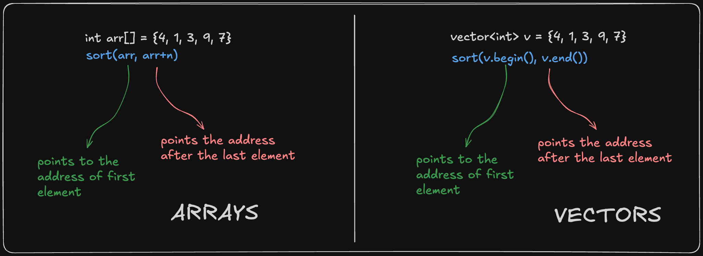

### **C++ STL Sorting 🧑‍💻✨**

In C++, the **Standard Template Library (STL)** provides the `std::sort` algorithm for sorting containers like arrays, `std::vector`, and other random-access iterators. It is part of the `<algorithm>` header.

- `sort` is used to sort the containers which allow random access `[array, vector, deque]`, (i.e. you can access the `i`th item in constant time.)
- `sort` function recieves two addresses, first address is of the first element and second address is the address after the last element



---

### **📜 Syntax**

```cpp
#include <algorithm>

// Default ascending order
std::sort(start_iterator, end_iterator);

// Custom comparator
std::sort(start_iterator, end_iterator, compare_function);
```

- **`start_iterator`**: Iterator pointing to the beginning of the range.
- **`end_iterator`**: Iterator pointing to the end of the range.
- **`compare_function`** (Optional): A custom comparison function or lambda expression.

---

### **1. Basic Sorting (Ascending Order) 🔼**

```cpp
#include <iostream>
#include <vector>
#include <algorithm>

int main() {
    std::vector<int> v = {4, 1, 3, 9, 7};

    std::sort(v.begin(), v.end());  // Sorting in ascending order

    for (int i : v) {
        std::cout << i << " ";
    }
    return 0;
}
```

#### **Output:**

```
1 3 4 7 9
```

---

### **2. Sorting in Descending Order 🔽**

You can use `std::greater<int>()` or a **lambda function** to reverse the order.

```cpp
#include <iostream>
#include <vector>
#include <algorithm>
#include <functional>

int main() {
    std::vector<int> v = {4, 1, 3, 9, 7};

    std::sort(v.begin(), v.end(), std::greater<int>());  // Sorting in descending order

    for (int i : v) {
        std::cout << i << " ";
    }
    return 0;
}
```

#### **Output:**

```
9 7 4 3 1
```

---

### **3. Custom Comparator 🔧**

Use a custom comparator to modify the sorting behavior:

```cpp
#include <iostream>
#include <vector>
#include <algorithm>

bool customSort(int a, int b) {
    return (a % 2) < (b % 2);  // Even numbers first
}

int main() {
    std::vector<int> v = {5, 2, 8, 1, 3};

    std::sort(v.begin(), v.end(), customSort);  // Custom sorting logic

    for (int i : v) {
        std::cout << i << " ";
    }
    return 0;
}
```

#### **Output:**

```
2 8 5 1 3
```

---

```cpp
#include <algorithm>
#include <iostream>

using namespace std;

struct Point {
  int x, y;
};

bool compare(Point a, Point b) {
  return a.x < b.x;
}

int main() {
  Point arr[] = {{3,10}, {2,8}, {5,4}};
  int n = sizeof(arr) / sizeof(arr[0]);
  sort(arr, arr + n, compare);
  for(auto i: arr) {
    cout << i.x << " " << i.y << endl;
  }
  return 0;
}
```

#### **Output:**

```
2 8
3 10
5 4
```

---

### **4. Sorting an Array 📐**

You can also sort **arrays** just like vectors.

```cpp
#include <iostream>
#include <algorithm>

int main() {
    int arr[] = {5, 2, 9, 1, 5};
    int n = sizeof(arr) / sizeof(arr[0]);

    std::sort(arr, arr + n);  // Sorting the array

    for (int i = 0; i < n; i++) {
        std::cout << arr[i] << " ";
    }
    return 0;
}
```

#### **Output:**

```
1 2 5 5 9
```

---

### **Key Points about `std::sort` 🔑**

1. **⏱️ Time Complexity:** `O(n log n)` on average case and worst case. Also number of comparisons is also `(n log n)`
2. **⬆️ Sorting Order:** Ascending by default.
3. **🛠️ Custom Comparator:** You can define custom sorting logic.
4. **📦 Container Support:** Works with containers that support random-access iterators (e.g., `std::vector`, arrays, `std::deque`).
5. **🔄 Uses Intro Sort:** Hybrid of Quick Sort, Heap Sort and Insertion Sort
